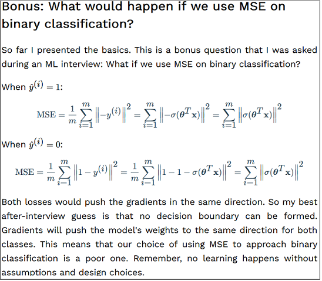

# What would happen if we use MSE on binary classification?

**PDF version of this README with LaTeX formulas rendered:** [https://raw.githubusercontent.com/Jonas1312/mse-for-binary-classification/main/README.pdf](https://raw.githubusercontent.com/Jonas1312/mse-for-binary-classification/main/README.pdf)

## Context

Some comments on the "Bonus" section of [this article](https://theaisummer.com/mle/#bonus-what-would-happen-if-we-use-mse-on-binary-classification) from AI Summer.

***Edit:** The article has been updated with my demonstration [(link)](https://theaisummer.com/mle/#proposed-demonstration-by-jonas-maison).*

## Screenshot of the original article

## Review

1) "When $\hat{y}^{(i)} = 1$" and "When $\hat{y}^{(i)} = 0$" are inverted.

3) I have no idea why the authors replace $y^{(i)}$ with $\sigma(\theta^\intercal x)$ or $1-\sigma(\theta^\intercal x)$ when the class changes. If properly trained, the model weights should "push" the sigmoid to output 0 or 1 depending on the input $x$.
4) The proposed demonstration don't prove anything:
   1) When $y^{(i)} = 0$, negative class:

       $$MSE = \frac{1}{m}\sum_{i}^{m}{{\lVert -\hat{y}^{(i)} \rVert}^2} = \frac{1}{m}\sum_{i}^{m}{{\lVert \sigma(\theta^\intercal x) \rVert}^2}$$
   2) When $y^{(i)} = 1$, positive class:

       $$MSE = \frac{1}{m}\sum_{i}^{m}{{\lVert 1-\hat{y}^{(i)} \rVert}^2} = \frac{1}{m}\sum_{i}^{m}{{\lVert 1- \sigma(\theta^\intercal x) \rVert}^2}$$

## Proposed demonstration

Let's assume that we have a simple neural network with weights $\theta$ such as $z=\theta^\intercal x$, and outputs $\hat{y}=\sigma(z)$ after a sigmoid activation.

The chain rule gives us the gradient of the loss $L$ with respect to the weights $\theta$:
$$\frac{\partial L}{\partial \theta}=\frac{\partial L}{\partial \hat{y}}\frac{\partial \hat{y}}{\partial z}\frac{\partial z}{\partial \theta}$$

MSE loss is expressed as follows:
$$L(y, \hat{y}) = \frac{1}{2}(y-\hat{y})^2$$

Thus, the gradient with respect to $\theta$ is:

$$\frac{\partial L}{\partial \theta}=-(y-\hat{y})\sigma(z)(1-\sigma(z))x$$

$$\frac{\partial L}{\partial \theta}=-(y-\hat{y})\hat{y}(1-\hat{y})x$$

We can see that $\sigma(z)(1-\sigma(z))$ makes the gradient vanish if $\sigma(z)$ is too close to 0 or 1. Thus, the neural net can't train properly.

When we try with a BCE loss:
$$L(y, \hat{y}) = -ylog(\hat{y})-(1-y)log(1-\hat{y})$$

For $y=0$ (negative class), we have:
$$\frac{\partial L}{\partial \theta}=\frac{1-y}{1-\hat{y}}\sigma(z)(1-\sigma(z))x$$

$$\frac{\partial L}{\partial \theta}=\frac{1-y}{1-\hat{y}}\hat{y}(1-\hat{y})x$$
 
$$\frac{\partial L}{\partial \theta}=(1-y)(\hat{y})x$$

$$\frac{\partial L}{\partial \theta}=\hat{y}x$$

If the network is right and predicted the negative class, $\hat{y}=0$, the gradient is null as expected.
    
For $y=1$ (positive class), we have:

$$\frac{\partial L}{\partial \theta}=-\frac{y}{\hat{y}}\sigma(z)(1-\sigma(z))x$$

$$\frac{\partial L}{\partial \theta}=-\frac{y}{\hat{y}}\hat{y}(1-\hat{y})x$$

$$\frac{\partial L}{\partial \theta}=-y(1-\hat{y})x$$

$$\frac{\partial L}{\partial \theta}=-(1-\hat{y})x$$

If the network is right, $\hat{y}=1$, the gradient is null as expected.
